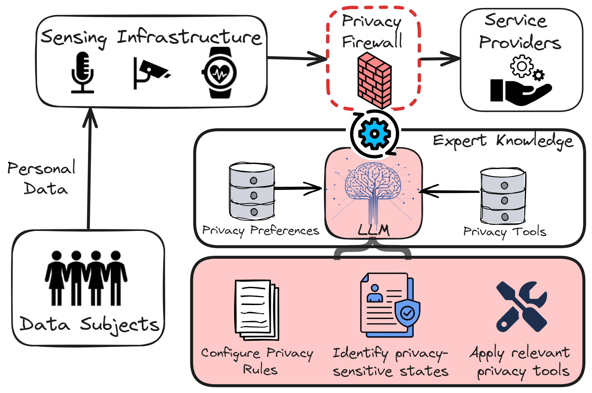
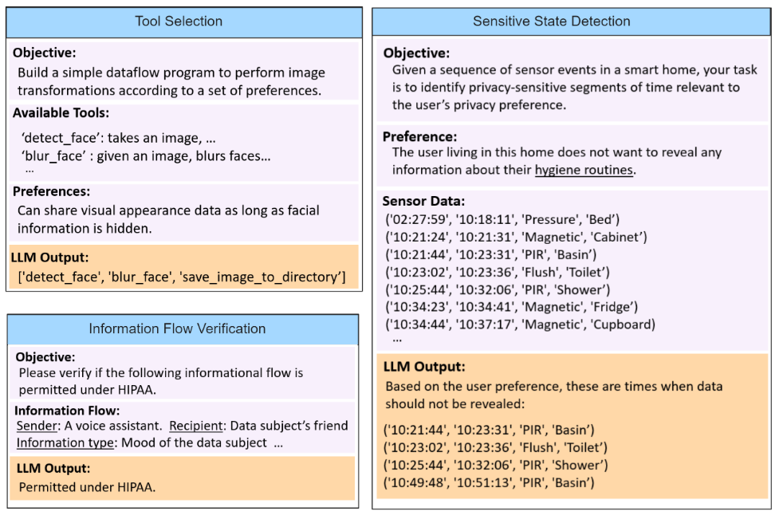

## Introduction

PrivacyOracle enables qualitative reasoning over privacy regulations, understanding of privacy-sensitive contexts, and is able to apply privacy transformations given a set of privacy preferences.  It utilizes Large Language Models (LLMs) to configure *privacy firewalls* for protecting user sensor data in smart environments.



This repo provides the logic and evaluation of PrivacyOracle on three tasks:
1. Measuring acceptability of sensory informational flows against privacy regulations (HIPAA) and social norms.
2. Inferring privacy-sensitive states from lower level sensory data used in Activity of Daily Living scenarios.
3. Designing privacy-aware data processing pipelines for video data from doorway/hallway cameras.

To give an idea of what these tasks are, refer to the figure below:

The "information flow verification" refers to task 1, the "sensitive state detection" refers to task 2, and lastly, the "tool selection" refers to task 3.


## Setup

In order to query ChatGPT, you need to acquire an [OpenAI API key](https://platform.openai.com/api-keys).  Save the secret key to a document called "API_KEY" without any file extension.

To run the private state experiments, you also need to download the [ADL dataset](https://archive.ics.uci.edu/dataset/271/activities+of+daily+living+adls+recognition+using+binary+sensors) from the UCI ML repo.  Please move this to the *datasets* folder.

To run the privacy pipeline experiments, you will also need to download the [Chokepoint](https://arma.sourceforge.net/chokepoint/) dataset.  Please also move this to the *datasets* folder.

Once you have completed these steps, you should see the following folder and file structure:

```
PrivacyOracle/
├── API_KEY
├── datasets/
│   ├── UCI ADL Binary Dataset/
│   └── Chokepoint/
├── prompts/
├── query/
├── evaluation/
├── run_queries.py
├── evaluate.py
├── results/
├── README.md
└── requirements.txt
```

As a final step, you will need to install all the software dependencies:
```
pip install -r requirements.txt
```

## Cost of Running Experiments

Before you begin running the experiments, it's important that you are aware of the [prices of each token](https://openai.com/pricing) of doing so.  In these experiments we utilize GPT3.5 Turbo and GPT-4, which (at the current time of writing) are roughly $0.0005 per token and $0.03 per token, respectively.  Some experiments, particularly those for evaluate privacy states, can incur higher costs due to the number of tokens sent.  As a rough ballpark, running all the experiments once costs roughly $15-20 USD.  Please keep this cost in mind before running your experiments.

## Running Experiments


To perform querying of LLMs, we run the following command:
```
python run_queries.py --exp EXP_NAME
```
This allows us to send prompts and retrieve the necessary information for the aforementioned tasks.  *EXP_NAME* should be replaced with 'flow', 'state' or 'pipeline', depending on which task you want to receive responses for.  Results of this command are saved in the *results* folder, where the dialogue with the LLM is saved for future evaluation.

To run evaluation of each task, we run the following command:
```
python evaluate.py --exp EXP_NAME
```
This allows us to evaluate the responses from the LLM.  Like before, *EXP_NAME* should be replaced with 'flow', 'state' or 'pipeline', depending on which task you wish to evaluate.  'flow' will evaluate performance of the LLM's responses against ground truth social norms.  'state' will evaluate performance of the LLM's responses against ground truth states from the ADL dataset.  Lastly, 'pipeline' will execute the data processing pipeline described by the LLM on real video data, and evaluate its privacy and utility.


## Acknowledgements

- We utilize GPT3.5 and GPT4 from [OpenAI](https://openai.com/) as the LLM of choice.
- We perform evaluation on the [Activities of Daily Living Using Binary Sensors Dataset](https://archive.ics.uci.edu/dataset/271/activities+of+daily+living+adls+recognition+using+binary+sensors) from University of California, Irvine.
- We also perform evaluation on the [Chokepoint](https://arma.sourceforge.net/chokepoint/) video dataset. 
